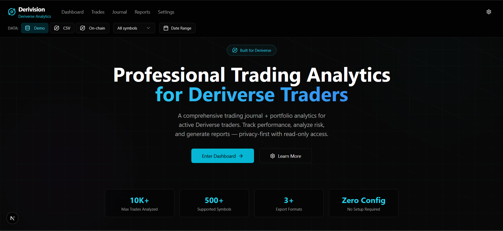
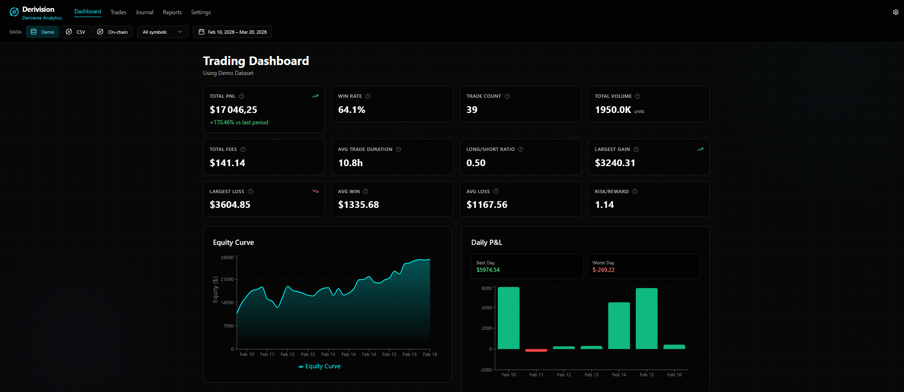
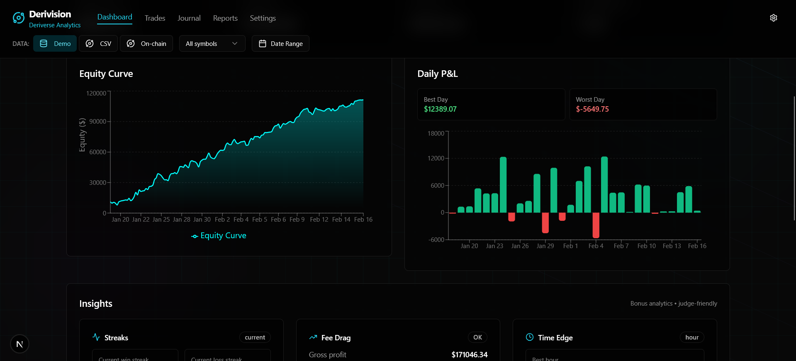
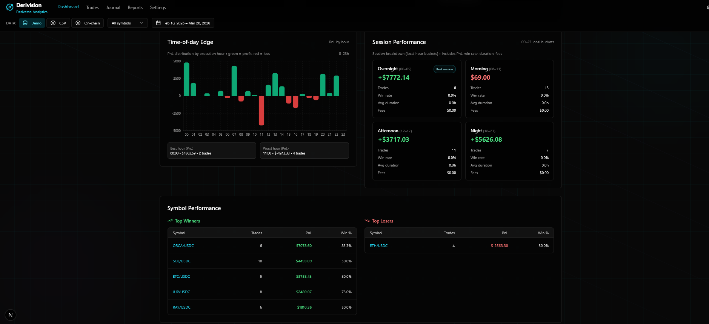
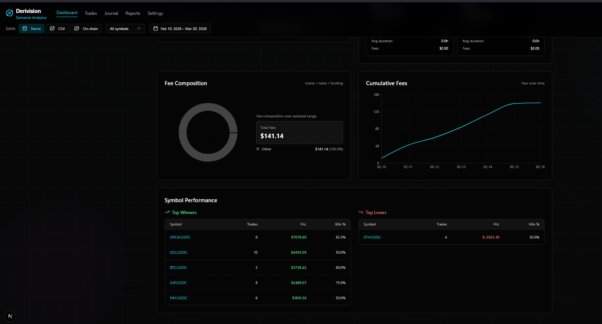
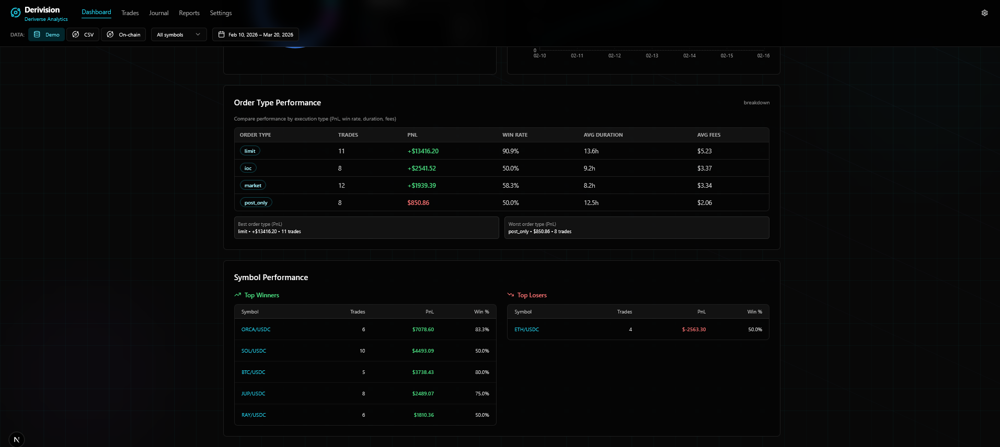
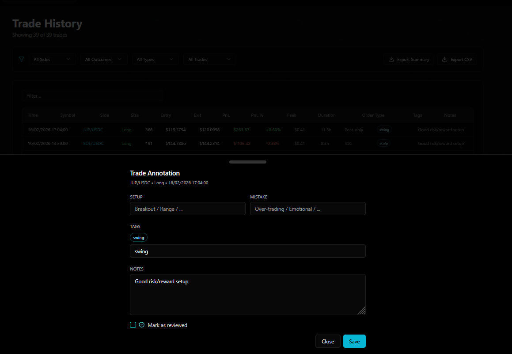
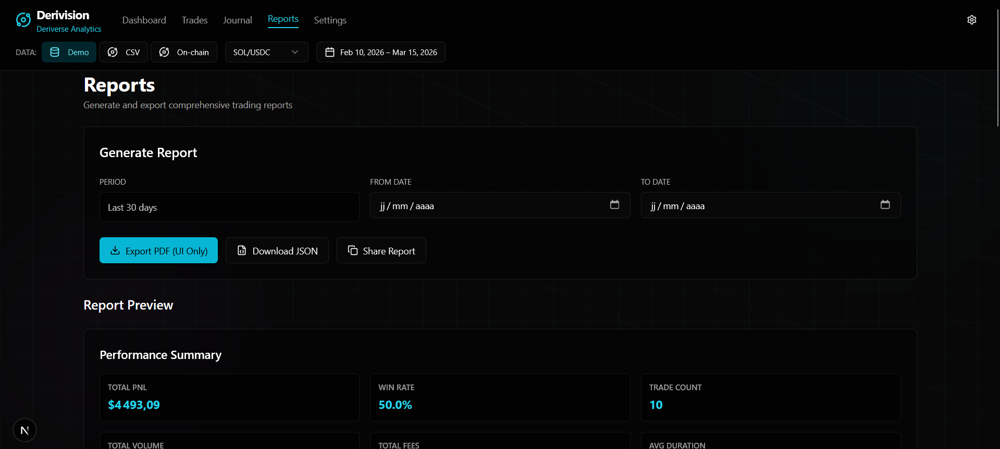

# Derivision — Deriverse Trading Analytics

**A comprehensive trading analytics solution for Deriverse**: professional trading journal + portfolio/performance analytics for active traders.

- Live demo: https://deriverse-analytics-v1tz.vercel.app/
- X (Twitter): https://x.com/KhadiraOussama

---

## Highlights

- **Comprehensive scope coverage**: KPIs, charts, global filters, fees, time-based metrics, reports, journal, and trade history with annotations.
- **Accuracy-focused**: metrics computed from a normalized trade model; JSON report export includes **filters + KPI formulas**.
- **Trader-first UX**: clear hierarchy (KPI grid → charts → breakdowns), tooltips, and consistent global filters.
- **Bonus insights**: time-of-day + session edge analysis and behavioral insights.
- **Security & privacy**: **no private keys**, read-only address analysis, annotations stored locally (localStorage).

---

## Bounty scope checklist ✅ (1:1 with requirements)

- ✅ **Total PnL tracking** with visual indicators (KPI + equity curve)
- ✅ **Trading volume & fee analysis** (KPIs + fee analytics)
- ✅ **Win rate & trade count** metrics
- ✅ **Average trade duration** calculations
- ✅ **Long/Short ratio** + directional bias tracking
- ✅ **Largest gain/loss** + **avg win/loss** for risk management
- ✅ **Symbol filtering** + **global date range selection** (applies across pages, end-date inclusive)
- ✅ **Historical PnL** charts + **drawdown visualization**
- ✅ **Time-based performance**: daily + **time-of-day** + **session-based** breakdown
- ✅ **Detailed trade history table** (sorting/pagination/filters/search) + **annotation capabilities** (tags/notes/reviewed)
- ✅ **Fee composition breakdown** + **cumulative fee tracking**
- ✅ **Order type performance analysis** (PnL/win rate/duration/fees by order type)
- ✅ **Reports**: JSON export (includes filters + formulas) + PDF via Print → “Save as PDF”

---

## Screenshots (curated)

> All screenshots are from the deployed build and show real interactions (filters, exports, annotations).

### 1) Landing (Deriverse-first)


### 2) Dashboard overview (KPIs + charts)


### 3) Equity curve + drawdown visualization


### 4) Time-based analytics (time-of-day edge + session performance)


### 5) Fee analytics (composition + cumulative fees)


### 6) Order type performance analysis


### 7) Trade history table


### 8) Trade annotations (notes/tags/reviewed)


### 9) Reports exports (PDF/JSON/share + active filters)


---

## Product overview

### Pages
- **Dashboard**: KPI grid + equity curve/drawdown + daily P&L + time-of-day + sessions + fees + order types + symbol performance
- **Trades**: advanced trade table + export + per-trade annotations
- **Journal**: structured entries (setup, confidence, mistake tags) + journal analytics
- **Reports**: filter-aware export (JSON + formulas, PDF via print)
- **Settings**: display preferences + privacy/security notes

### Global filters (applies across pages)
- Data mode: **Demo / CSV / On-chain**
- **Symbol filter**
- **Date range** (inclusive end date)

---

## Architecture (high-level)

```mermaid
flowchart LR
  UI[UI - Next.js App Router] --> CTX[App context (symbol, date range, data mode)]
  CTX --> HOOK[useTrades hook]
  HOOK --> ADP[Adapters (Demo, CSV, On-chain)]
  ADP --> NORM[NormalizedTrade list]
  NORM --> MET[Metrics engine (computeMetrics)]
  MET --> UI

  UI --> ANN[Trade annotations (localStorage)]

  subgraph ONCHAIN[On-chain mode]
    RPC[Solana RPC] --> SDK[Deriverse kit]
    SDK --> ADP
  end
```

**Key idea:** everything runs on a **normalized trade model**, so charts/tables/reports stay consistent across data sources.

---

## Run locally

### Prerequisites
- Node.js 18+ (20+ recommended)

### Install & dev
```bash
npm install
npm run dev
# open http://localhost:3000
```

### Build
```bash
npm run build
npm run start
```

### Tests
```bash
npm test
```

---

## Data modes

### Demo (recommended for judging)
- Fully populated deterministic dataset for consistent screenshots.

### CSV Import
- Paste/import your trade history via CSV to compute the same analytics locally.

### On-chain (Deriverse on Solana)
- Read-only address analysis (no wallet permissions).
- Uses Solana RPC + Deriverse SDK. Configure env vars on Vercel or locally.

---

## Metric accuracy (how calculations work)

All analytics are computed from a single normalized trade model (`NormalizedTrade`) to keep charts, tables, and exports consistent across data sources.

**Core definitions**
- **Total PnL:** `Σ pnlUsd`
- **Win rate:** `(winningTrades / totalTrades) * 100`
- **Total fees:** `Σ feesUsd`
- **Avg duration (hours):** `avg(durationSec / 3600)`
- **Long/Short ratio:** `longTrades / shortTrades`
- **Risk/Reward:** `avgWin / avgLoss` (absolute values)
- **Equity curve:** starting equity baseline + cumulative PnL
- **Drawdown (%):** `(peakEquity − equity) / peakEquity * 100`

**Quality checks**
- Key metric logic is covered by automated tests (Vitest).
- The exported JSON report includes **active filters + KPI formulas** for transparency.

---

## Security & privacy

- **No private keys stored or requested**.
- On-chain mode uses a **read-only address** (public key) for analysis.
- Trade annotations are saved locally in the browser (**localStorage**).
- No funds are moved, and no transactions are signed.

---

## Submission links

- **GitHub repo:** (this repository)
- **Live demo:** https://deriverse-analytics-v1tz.vercel.app/
- **X (Twitter):** https://x.com/KhadiraOussama
